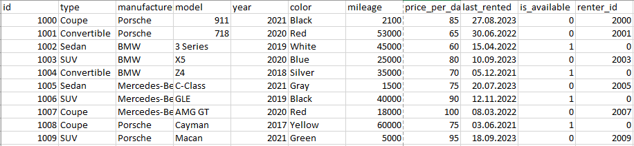
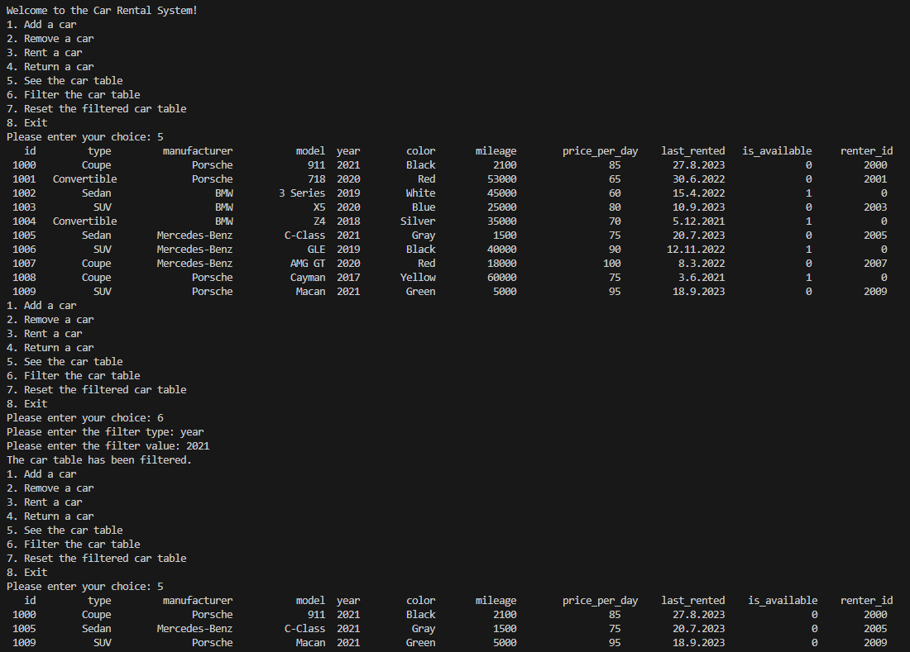

# Car Rental System

## Abstract of the Project
In this project, we've developed a rental system for cars. The system operates by utilizing a .csv file that contains information about the availability of cars for rental. This dataset is editable, allowing us to make various modifications.

Within the system, we can perform the following actions on the dataset:

- Add a new car to the dataset.
- Remove an existing car from the dataset.
- Rent out an available car.
- Return a car that has already been rented out.

In addition to these modifications, the system provides the ability to:

- Display the dataset in a table within the terminal.
- Apply filters based on car types, manufacturers, models, mileage, and other criteria.

## The Dataset
Following is a screen-shot of the dataset.

  

## Output Example
Following you can find a screen-shot of a test output.

  

## Folder Structure
- `car_data_set.csv`: The dataset of the cars.
- `scripts/source_files`: Here we can find all the .cpp scripts.
- `scripts/header_files`: Here we can find all the header files.
- `scripts/build_files`: Here the build-file of the main is to be found.
